<p align="center">
  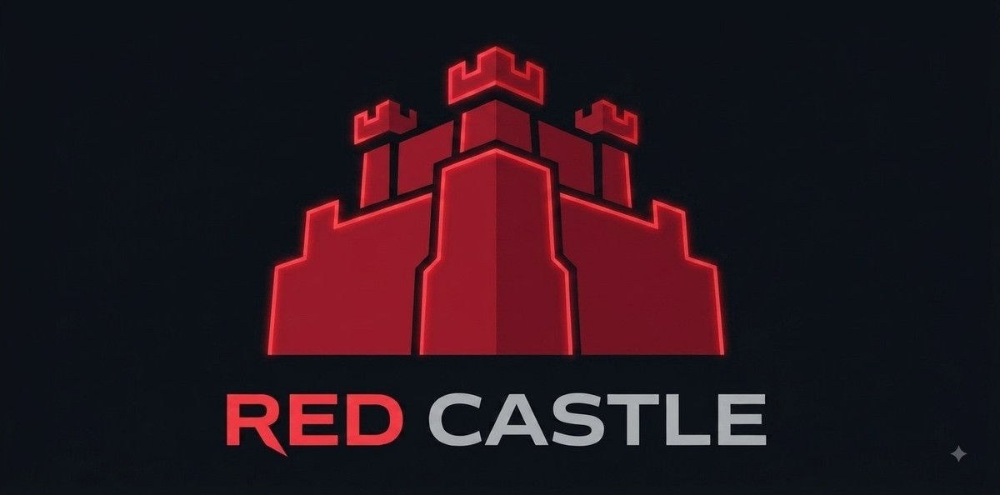
</p>

<h1 align="center">Team The Red Castle — WRO 2026 Future Engineers</h1>

An autonomous, self-driving model car for the **World Robot Olympiad 2026,
Future Engineers** category. It completes the **Open Challenge** (three laps of a
track with a randomised wall layout) and the **Obstacle Challenge** (three laps
avoiding red and green traffic signs, then parallel-parks) using a **single
camera as its only sensor** — no LiDAR, no ultrasonic rangefinders, no wheel
encoders, no IMU.

> **Design thesis:** everything the car needs to know — where the walls are, which
> way to lap, where the traffic signs are, and where the parking lot is — is
> visible. A well-tuned camera plus disciplined image processing can do the whole
> job, so we spent our engineering effort on making that one sensor reliable
> rather than fusing many.

---

## Table of contents
1. [The challenge](#1-the-challenge)
2. [Vehicle at a glance](#2-vehicle-at-a-glance)
3. [Mobility management](#3-mobility-management)
4. [Power & sense management](#4-power--sense-management)
5. [Software & obstacle management](#5-software--obstacle-management)
   · [flowchart](#51b-control-loop-flowchart) · [state machine](#51c-obstacle-challenge-state-machine)
   · [subsystem map](#56-how-the-subsystems-fit-together)
   · [testing & metrics](#57-testing-tuning-and-validation)
   · [risks](#58-risks-and-mitigations)
6. [Calibration workflow](#6-calibration-workflow)
7. [Build & run](#7-build--run)
8. [Bill of materials & cost](#8-bill-of-materials--cost)
9. [Engineering process](#9-engineering-process)
10. [Results & future work](#10-results--future-work)
11. [Repository map](#11-repository-map)
12. [Team](#12-team)

---

## 1. The challenge

WRO Future Engineers asks for a fully autonomous vehicle that drives a track
bounded by walls:

- **Open Challenge** — 3 laps; the inner walls are placed at random distances each
  round, so the path width changes and cannot be hard-coded.
- **Obstacle Challenge** — 3 laps with red/green **traffic signs** on the track:
  the car must pass **red signs on their right** and **green signs on their left**,
  then finish by **parking** in the magenta parking lot.

Scoring rewards completing laps without touching walls or signs, correct sign
handling, a clean park, and — importantly — **thorough engineering documentation**
(this repository).

## 2. Vehicle at a glance

| Subsystem | Choice |
|---|---|
| **Compute** | Raspberry Pi 4 Model B, **2 GB RAM** (Raspberry Pi OS *Bookworm*, 64-bit) |
| **Sensor** | **OV5647 Wide-angle** camera (5 MP, ~120° FOV, **fixed focus**) — sole sensor |
| **Steering** | **Ackermann** front steering, SG90 servo on **GPIO13**, **±35° max** |
| **Drive** | **N20 gear motor** (12 V, 200 rpm) → **25:20 gear pair** → **differential** on the rear axle |
| **Driver** | **L9110S** H-bridge on **GPIO24 / GPIO23** |
| **Power** | 3 × 18650 (series) → motor driver directly; separate buck converter → Pi; common ground |
| **Chassis** | 3D printed in **PLA+ Silk Silver** on a **Bambu Lab A1**, designed in **Fusion 360** |
| **Software** | Python 3, OpenCV, Picamera2 |

_Vehicle photos: [`v-photos/`](v-photos) · driving video: [`video/video.md`](video/video.md)_

### Specifications

| Property | Value |
|---|---|
| Drive motor | N20 gear motor, 12 V, 200 rpm |
| Transmission | 25:20 spur pair (1.25:1) → differential, rear axle |
| Steering | Ackermann, ±35° max |
| Camera height / tilt | 12.5 cm above the mat / ~15° down |
| Mass | **407 g** |
| Theoretical top speed | **≈ 0.39 m/s** (39 cm/s), no-load — see §3.4 |
| Wheel diameter | **4.7 cm** |
| Wheelbase (front axle ↔ rear axle) | **9.4 cm** |
| Track (rear wheel centre ↔ centre) | **8.5 cm** |
| Overall dimensions (L × W × H) | **14.2 × 9.3 × 15 cm** |
| Print material | PLA+ Silk Silver |
| Printer / CAD | Bambu Lab A1 / Fusion 360 |

_Measured max speed on the mat is still to be timed — the figure above is the
motor's theoretical no-load ceiling (§3.4)._

## 3. Mobility management

### 3.1 Chassis
A custom chassis designed in **Fusion 360** and 3D printed in **PLA+ Silk Silver**
on a **Bambu Lab A1** (source CAD, STLs and sliced plates in [`models/`](models)).
It carries the Pi, battery, motor driver, drive motor, steering servo and the
camera mast. Design priorities: low and central mass, a rigid camera mast, and
easy access to the wiring.

<p align="center">
  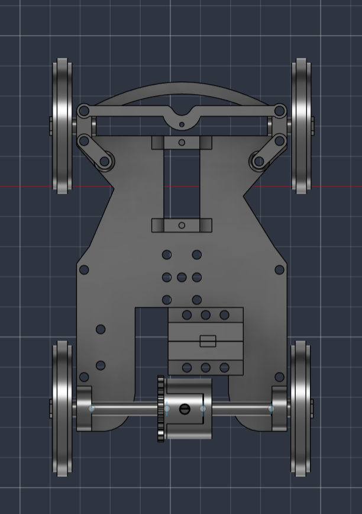
  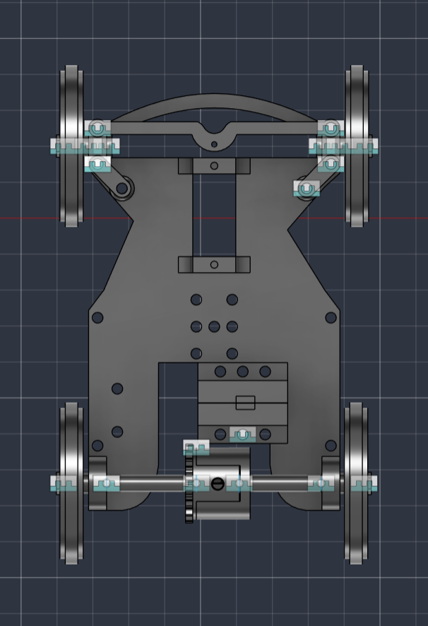
</p>

### 3.2 Steering — Ackermann
Front-wheel **Ackermann steering** driven by a single SG90 servo (GPIO13, a
hardware-PWM pin for a smooth, low-jitter signal). The servo drives a central
bell-crank and tie-rod to both steering knuckles, so the **inner wheel turns more
sharply than the outer one** through a corner — each wheel follows its own turning
radius instead of fighting the other.

**Maximum steering angle: ±35°**, the mechanical limit of the linkage. `STEER_MAX`
in [`src/config.py`](src/config.py) caps *every* steering command — wall-following,
obstacle-passing and emergency turns — from one constant.

### 3.3 Drivetrain — differential
An **N20 gear motor (12 V, 200 rpm)** drives the rear axle through a **25:20 gear
pair (1.25:1 reduction)** into a **differential**.

> **Engineering decision — why a differential mattered.** Our first drivetrain
> used a *solid* rear axle, forcing both driven wheels to the same speed. In a
> corner the outer wheel must travel further than the inner one, so with a solid
> axle they *scrub* — losing traction, pushing the car wide, and sometimes
> stalling it mid-turn. We worked around it by cutting the steering limit down to
> roughly **8°**, which kept traction but left the car unable to corner properly.
> Fitting a **differential** removed the constraint at its source: the wheels can
> now rotate at different speeds, so we run the **full ±35°** of the linkage and
> corner tightly without scrub. See [`ENGINEERING-JOURNAL.md`](ENGINEERING-JOURNAL.md).

The motor is driven by an **L9110S** dual H-bridge:

| L9110S | Connection |
|---|---|
| `A-IA` | GPIO24 — PWM here = **forward** |
| `A-IB` | GPIO23 — PWM here = **reverse** |
| `VCC` | Battery + (motor supply) |
| `GND` | Common ground |
| MOTOR-A | Drive motor |

Speed = PWM duty on one input, the other held LOW. The L9110S was chosen for its
tiny size and simple two-pin-per-motor interface.

> **Safety rule in software.** `motor()` **never switches forward↔reverse
> directly**: it first coasts to a stop and waits (`STOP_FLIP_DELAY`) before
> driving the other way. A hard reversal while the motor is still spinning dumps
> the motor's back-EMF onto the supply and can destroy the Pi's regulator — we
> learned this the hard way (see the journal).

### 3.4 Torque and speed reasoning

The drivetrain was sized around one question: **how fast can the car go while the
vision loop still has time to react?**

**Speed chain**

```
N20 motor          200 rpm  @ 12 V (no load)
  ↓ 25:20 spur pair (1.25:1 reduction)
Differential axle  200 / 1.25 = 160 rpm
  ↓ wheel circumference
Ground speed       v = π · D · 160 / 60   (D = wheel diameter in m)
```

With our **measured wheel diameter (4.7 cm)**:

```
v = π × 0.047 m × 160 rpm / 60 = 0.394 m/s  ≈ 39 cm/s  (no-load ceiling)
```

That is the motor's theoretical maximum with nothing slowing it down. The real
figure is lower once tyre friction, the differential, and the car's 407 g mass are
accounted for — a timed run over a measured distance is a pending test, and the
result will replace this estimate in the specifications table above.

**Why gear down at all?** The 1.25:1 reduction trades ~20 % of top speed for
~25 % more torque at the axle (torque scales with the reduction, speed inversely).
That matters because:

- The car must **pull away from rest** repeatedly and climb over the mat seam
  without stalling. Our earlier drivetrain *did* stall — see the journal.
- The L9110S wastes ~1.5–1.8 V, so the motor never sees the full pack voltage;
  extra mechanical advantage compensates for the lost electrical headroom.
- More torque means the controller can use **lower duty cycles** for the same
  motion, which keeps current (and driver heating) down.

**Why not faster?** The vision loop runs at a finite frame rate. At ~0.5 m/s the
car covers ~2–3 cm per frame, so a wall or sign is seen many frames before it
matters. Doubling the speed would halve that reaction margin without improving the
score — the challenge rewards *completing* laps cleanly, not raw speed. The
software also **reduces speed in proportion to steering effort**
(`cruise_speed()`), so the car is fastest exactly where it is safest: on straights.

**Mechanical stability.** At **407 g** total mass on a **14.2 × 9.3 × 15 cm**
footprint, the car is light and compact enough that keeping mass low and central
matters for cornering grip — the battery and Pi sit over the **9.4 cm wheelbase**,
between the front and rear axles, rather than overhanging either end. The **8.5 cm**
rear track keeps the wheelbase-to-track ratio close to 1:1, which is a stable
proportion for cornering without tipping risk. The camera sits on a rigid mast
rather than a flexible arm, and the Ackermann geometry means the wheels roll
rather than scrub through a corner. A vibrating camera would corrupt the wall
measurements, so mast rigidity is a control requirement, not a cosmetic one.

## 4. Power & sense management

### 4.1 Power topology
Early on, the Pi rebooted every time the motor drew current. The fix defines our
power design and is now standard on the car:

```
3 x 18650 (series) ─┬──────────────────────► L9110S VCC   (motor power, direct)
   via rocker switch└─► DC-DC buck (5 V) ───► Raspberry Pi 5V
Battery − ──── common ground ── L9110S GND ── Pi GND
```

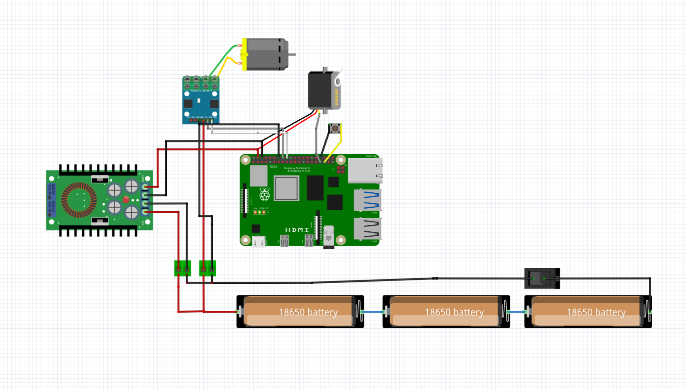

_Full wiring notes: [`schemes/`](schemes)._

1. **Separate rails** — the motor draws straight from the battery; the Pi has its
   **own regulator**. Motor current spikes never pass through the Pi's supply.
2. **Common ground** — Pi, driver and battery negatives are tied together so the
   GPIO control signals share a reference. (Without it, the only link between Pi
   and driver is the signal wire, and motor return current back-feeds the GPIO pin
   — which browns out or damages the Pi.)

### 4.2 Power budget

Sizing the pack: what draws current, how much, and for how long.

| Load | Rail | Typical | Peak | Notes |
|---|---|---|---|---|
| Raspberry Pi 4 (2 GB) | 5 V (buck) | ~0.6 A | ~1.2 A | rises while the vision loop runs |
| OV5647 camera | 3.3 V via CSI | ~0.25 A | ~0.25 A | powered by the Pi, no separate rail |
| SG90 steering servo | 5 V (buck) | ~0.15 A | ~0.7 A | peak only during a fast steering step |
| N20 drive motor | 12 V (battery) | ~0.15 A | ~0.8 A | limited by the L9110S's ~0.8 A ceiling |
| L9110S quiescent | 12 V | ~0.01 A | — | negligible |

**Reasoning**

- **Pi rail:** 0.6 + 0.25 + 0.15 ≈ **1.0 A typical**, ~2.1 A worst case if the Pi
  peaks while the servo slams. The buck converter is specified at **≥ 3 A**, giving
  roughly 40 % headroom over the worst case — deliberately generous, because
  under-sizing this rail is what caused our early brownouts.
- **Motor rail:** the motor is fed **straight from the pack**, so its spikes never
  touch the Pi's rail. This separation is the single most important power decision
  on the car (§4.1).
- **Runtime:** 3 × 18650 in series keeps the *capacity* of one cell (~2500–3000 mAh)
  while tripling voltage. The 12 V side draws ~0.15 A average; the 5 V side draws
  ~1.0 A but the buck converter steps *down*, so the current it pulls from the 11 V
  pack is roughly `1.0 A × 5 V / 11 V / 0.85 ≈ 0.53 A`. Total ≈ **0.7 A**, giving on
  the order of **3–4 hours** of running — far beyond the few minutes a run needs.
  Practice sessions, not runtime, drain the pack.
- **Failure points considered:** motor stall (bounded by the L9110S current limit),
  reverse back-EMF (handled in software by a forced coast before any direction
  change), pack sag under load (why the rails are separated), and the fact that a
  freshly charged 12.6 V pack sits marginally above the L9110S's 12 V rating — a
  known watch-item logged in [`schemes/`](schemes).

_These are datasheet/typical figures used for sizing; a clamp-meter measurement of
the real draw is a pending task._

### 4.3 Sensing — the camera
The camera is the entire perception system, so most of our tuning went here.

**Sensor choice.** We began with a Raspberry Pi Camera Module 3 Wide (IMX708) but
switched to an **OV5647 wide-angle module**. The Module 3's large sensor and
autofocus lens gave a *shallow depth of field*: focus it on the mat and distant
traffic signs blurred, which desaturated their colour and made them undetectable.
The OV5647 is a **small-sensor, fixed-focus** module, so its depth of field covers
the whole track — near mat and far walls are sharp simultaneously — and there is
no autofocus to hunt mid-run. Losing autofocus cost us nothing; a ground robot
never needs to refocus.

**Connection.** The camera uses the Pi's dedicated **CSI port** via a flat ribbon
cable — it takes no GPIO pin and needs no separate power, which is why it does not
appear on the wiring diagram.

**Mount — justified by field geometry.** **12.5 cm above the mat**, tilted **~15°
downward**, centred laterally and facing straight ahead on a rigid mast. It is
physically mounted **upside-down**, so frames are rotated 180° in software.

Each number follows from the field itself:

| Choice | Driven by | Reasoning |
|---|---|---|
| **Height 12.5 cm** | walls are **10 cm** tall | The lens must sit **above the wall line** so the camera looks *down onto* the mat and sees the wall **base** — the white-mat/black-wall edge, the highest-contrast feature available. Below 10 cm the walls would fill the frame as a flat black band with no distance information. |
| **Not much higher** | depth resolution vs clutter | Raising the camera improves distance precision by only ~30 % at long range while showing more of the room *over* the walls. Not worth the extra clutter and mast flex — analysed in the journal. |
| **Tilt ~15° down** | track width & look-ahead | Enough downward angle to keep the mat and both wall bases in the lower frame, while still seeing far enough ahead to detect a corner and a traffic sign before reaching them. |
| **Centred, zero yaw** | left/right symmetry | Wall following compares the **left half against the right half** of the image. Any lateral offset or twist becomes a permanent steering bias that no amount of tuning removes. |
| **120° wide lens** | corridor width | A narrow lens cannot see **both** side walls at once in the corridor; the wide lens keeps both walls and the corner lines in a single frame. |
| **Rigid mast** | measurement noise | Vibration blurs the wall edge and injects noise straight into the steering loop, so mast stiffness is a control requirement, not cosmetic. |

**Calibration method.** Colour thresholds are field-calibrated, never hard-coded:
`tools/camera_tune.py` first fixes the *image* (exposure, gain, white balance,
saturation) and writes `camera_settings.json`; `tools/color_tuner.py` then samples
each real object on the real mat and writes `colors.json`. Steering centre is
calibrated by `tools/servo_center.py` into `servo_center.txt`. The car reads all
three files at start-up, so re-calibrating never means editing code.

**Locked settings** (`src/camera.py`), chosen from on-field capture tests:

| Setting | Value | Why |
|---|---|---|
| Sensor mode | 1296×972 (full ~120° FOV) → scaled to 640×480 | keep the wide FOV; cropped modes would lose it |
| Orientation | `hflip + vflip` (180°) | camera mounted upside-down |
| Focus | **fixed** (no AF hardware) | deep depth of field — sharp from the near mat to the far wall |
| Exposure | fixed (~9–12 ms) | freeze motion — auto-exposure ran ~60 ms and smeared when moving |
| White balance | locked `ColourGains` | keep HSV thresholds stable as the car turns toward/away from lights |
| Saturation | raised (~1.4) | separates red / orange / green / magenta in HSV, free in the ISP |

> **Why camera-only?** A single well-configured camera sees walls, the orange/blue
> corner lines, the coloured signs and the parking lot — everything the rules
> reference. Removing LiDAR/ultrasonic cut cost, weight, wiring and failure modes,
> and let us focus on making the vision robust (locked exposure/AWB, fixed focus,
> field-tuned HSV).

## 5. Software & obstacle management

All control software is in [`src/`](src). Four core modules import each other and
run together; the calibration and test utilities live in [`src/tools/`](src/tools).

```
src/robot.py               shared library — pins, servo()/motor(), HSV masks, wall/line/pillar analysis
src/camera.py              locked camera setup
src/open_challenge.py      Open Challenge main
src/obstacle_challenge.py  Obstacle Challenge main
```

### 5.1 Vision pipeline
`capture → 180° flip → crop the mat ROI → resize 320×160 → HSV`. HSV is computed
with `cv2.COLOR_BGR2HSV` everywhere so thresholds transfer between the tuner and
the challenge code. Six colours are thresholded from `colors.json` (produced by
`tools/color_tuner.py`):

- **black** → walls (dark-pixel density per image half → `left_wall`, `right_wall`)
- **blue / orange** → corner lines (driving direction + lap counting)
- **green / red** → traffic signs
- **magenta** → parking lot

### 5.1b Control-loop flowchart

Every frame runs the same loop. The only difference between challenges is which
decision block sits in the middle.

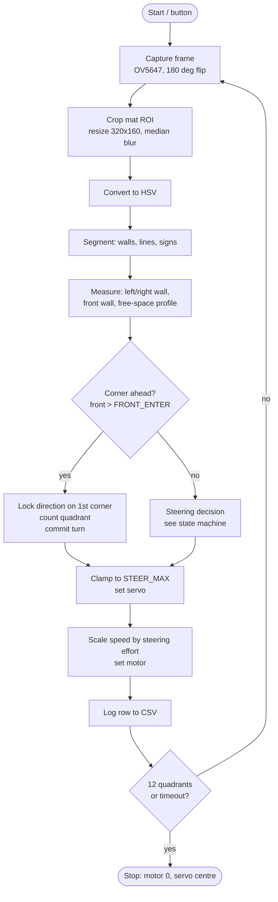

### 5.1b-2 Sensor fusion: geometry + colour lines

Direction and lap counting use **two independent signals** that cross-check each
other, so neither is a single point of failure:

| Signal | Strength | Weakness | What it drives |
|---|---|---|---|
| **Wall geometry** (front-wall fill) | always available; needs no colour calibration | says little about *which way* the track turns when the view is symmetric | **corner detection & lap counting** |
| **Colour lines** (orange = CW, blue = CCW) | the official WRO cue, unambiguous about direction | depends on colour tuning and lighting; may not be in frame | **direction** |

**Fusion rules**
- **Direction:** whichever signal arrives first locks it. The second either
  **CONFIRMS** it (logged) or raises a **disagreement warning** — and the
  direction never changes once locked.
- **Corners:** *either* signal may raise a corner. The **time guard**
  (`CORNER_MIN_INTERVAL_S`) means a corner seen by *both* is still counted
  **once**, so fusion adds robustness without risking double counts. The log
  records which source fired (`geom`, `line`, or `geom+line`).
- **Geometry only votes on direction when it actually knows.** Measured head-on to
  a corner, the two image halves read 0.26 vs 0.22 — a 0.04 difference that is
  noise, not information. It produced a confident but arbitrary guess that fought
  a correct colour cue. Geometry now requires `|left−right| ≥ GEOM_DIR_MIN_DIFF`
  (0.08) before offering an opinion.

Every run's log ends with a fusion summary, e.g.
`direction=CCW via colour line | corners=12 (geom 11, line 1) | disagreements=0`,
so after a run you can see exactly which sensor did the work.

### 5.1c Obstacle Challenge state machine

Steering is decided by a strict **priority**, so a lower-priority behaviour can
never override safety. The rationale for each level is in the right-hand column.

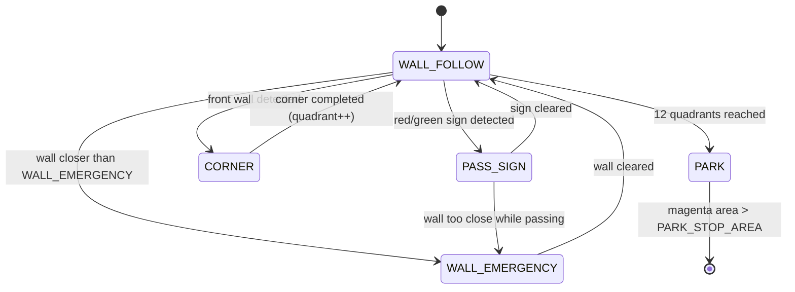

| Priority | State | Why it sits at this level |
|---|---|---|
| 1 (highest) | `WALL_EMERGENCY` | Touching a wall ends the run. Nothing may override it — not even an obstacle manoeuvre. |
| 2 | `PARK` | Once 3 laps are done the mission goal changes; parking outranks ordinary navigation. |
| 3 | `PASS_SIGN` | Sign obedience scores points, so it outranks plain lane keeping — but never safety. |
| 4 | `CORNER` | A committed turn, entered from wall geometry rather than colour (colour proved unreliable). |
| 5 (lowest) | `WALL_FOLLOW` | The default behaviour when nothing else applies. |

**Edge cases handled explicitly**
- *Corner counted twice in consecutive frames* → a **time guard**
  (`CORNER_MIN_INTERVAL_S`) plus a cycle debounce; a physical corner cannot recur
  within ~1.2 s.
- *Direction flip mid-run* → direction is **locked once** and never re-decided.
  Before the lock it can come from a corner line; after, never.
- *Colour line never detected* → the first corner's **geometry** decides direction,
  so the run does not depend on colour at all.
- *Sign lost for a frame* → `PILLAR_MEMORY_CYCLES` keeps the manoeuvre committed.
- *Robot stuck facing a wall* → `MAX_CORNER_CYCLES` forces the corner to complete.
- *Anything unexpected* → `MAX_RUNTIME_S` stops the car safely.

### 5.2 Open Challenge algorithm
1. **Wall-follow** the continuous *outer* wall with a **PD** controller — clockwise
   follows the left wall, counter-clockwise the right; either wall getting
   dangerously close forces a hard steer away.
2. **Direction** from the first corner line seen: **orange → clockwise**, **blue →
   counter-clockwise**.
3. **Lap counting** — a debounced falling edge on the driving-direction line counts
   one *quadrant*; **12 quadrants = 3 laps**, then the car coasts and stops.

### 5.3 Obstacle Challenge algorithm
A strict **per-frame priority** decides steering:

1. **Wall emergency** — never crash a wall, even mid-dodge.
2. **Park** (after 3 laps) — find the **magenta** lot, aim at it, stop when close.
3. **Sign** — pass **red on the right**, **green on the left** (steer to push the
   sign toward the correct frame edge; react harder as it nears).
4. **Wall-follow** — the Open-Challenge behaviour otherwise.

### 5.4 Speed
Base speed is `CRUISE`; `cruise_speed()` **eases off in proportion to steering
effort**, so the car runs fast on straights and slows automatically for corners.

## 5.6 How the subsystems fit together

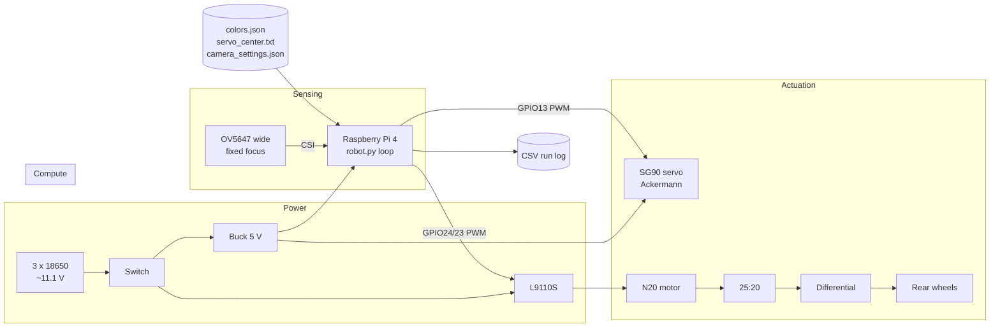

**Interactions that actually constrained the design**

| Interaction | Constraint it created |
|---|---|
| Motor ↔ Pi share one battery | Rails **must** be separated and grounds tied, or the Pi browns out (§4.1). |
| Drivetrain ↔ steering software | A solid axle forced `STEER_MAX` down to ~8°; the differential lifted it to 35°. Mechanics set the software limit. |
| Camera mount ↔ control loop | Mount height/tilt/rigidity determine what the controller can even measure; a loose mast is a control failure. |
| Lighting ↔ colour thresholds | Auto-exposure made HSV drift, so exposure and white balance are **locked** and colours re-tuned on the real mat. |
| Camera choice ↔ obstacle detection | Shallow depth of field blurred distant signs, so the sensor was swapped for a fixed-focus module. |
| Frame rate ↔ top speed | Speed is capped so the car moves only a few cm per frame, preserving reaction margin. |

## 5.7 Testing, tuning and validation

**How we test.** Each subsystem has a dedicated tool so faults are isolated rather
than guessed at (all in [`src/tools/`](src/tools)):

| Stage | Tool | What it proves |
|---|---|---|
| Wiring | `driver_on.py`, `test.py` | servo sweeps, motor turns both ways, camera captures |
| Motor limits | `motor_speed_steps.py` | steps 100 → 50 % to find the stall point |
| Motor path | `motor_debug.py` | separates a PWM fault from a power fault |
| Camera image | `camera_tune.py` | exposure/gain/saturation, with a live `mean_sat / blown% / dark%` read-out |
| Colour | `color_tuner.py` | each colour verified against its real object, mask checked for speckle |
| Perception | `freespace_test.py` | draws the detected wall boundary and chosen gap on a real frame — **nothing drives**, so perception is validated before control |
| Full run | `open_challenge.py` | logs every frame to `logs/*.csv` |

**Metrics we record.** Every run writes a CSV row per frame — timestamp, cycle,
direction, quadrant, in-corner flag, left/right wall, blue/orange line fractions,
steering and speed — plus a summary line (quadrants, cycles, elapsed time,
ms/cycle). That log is how we tune: after a bad run we read *why* the car did what
it did instead of guessing.

| Metric | Why it matters |
|---|---|
| ms per cycle | loop rate — sets how far the car travels blind between frames |
| quadrants counted vs. real corners | validates lap counting |
| seconds between corners | catches a corner counted twice or missed |
| left/right wall balance on a straight | proves the camera is centred and the controller is not biased |
| steering saturation (% of frames at `STEER_MAX`) | shows whether gains are too high |

**Tuning process.** Change one constant in [`src/config.py`](src/config.py) → run →
read the log → keep or revert. Because every threshold lives in one file and all
calibration lives in JSON/text files, a tuning change never risks breaking code.

## 5.8 Risks and mitigations

| Risk | Impact | Mitigation |
|---|---|---|
| Motor current spike browns out the Pi | run ends, SD card can corrupt | separate rails, own buck converter, common ground (§4.1) |
| Forward↔reverse slam destroys the regulator | hardware loss | `motor()` forces a coast + settle before any direction change |
| Lighting changes at the venue | colour masks fail | exposure/AWB locked; colours re-tuned on site in minutes via `color_tuner.py` |
| Corner line never detected | laps never counted | lap counting runs on **wall geometry**, colour is only a hint |
| Direction mis-detected | car laps the wrong way | direction locked once; `FORCE_DIRECTION` in config overrides at the venue |
| Camera knocked out of alignment | permanent steering bias | rigid mast; left/right balance check before every run |
| Mat markings read as a wall | false obstacle | boundary scan requires **N consecutive** dark rows (`FREE_MIN_RUN`) |
| Car stuck against a wall | run wasted | `MAX_CORNER_CYCLES` and `MAX_RUNTIME_S` force an exit/stop |
| Fresh pack exceeds L9110S 12 V rating | driver overheats | monitored; noted in [`schemes/`](schemes) |
| Algorithm underperforms on the day | lost points | `NAV_METHOD` switches between the free-space and proven density controller with one word |

## 6. Calibration workflow

Two field calibrations, saved to files that `robot.py` loads at start:

| Tool | Produces | Purpose |
|---|---|---|
| `tools/color_tuner.py` | `colors.json` | tune each colour with the real object in view |
| `tools/servo_center.py` | `servo_center.txt` | trim the steering so 0° = straight |
| `tools/motor_speed_steps.py` | — | find the motor's usable speed range |
| `tools/preview.py` | — | live camera view over VNC |

## 7. Build & run

**Raspberry Pi OS Bookworm** — Picamera2/OpenCV come from `apt`, **not** pip
(mixing a pip numpy breaks Picamera2):

```bash
sudo apt update
sudo apt install -y python3-picamera2 python3-libcamera python3-opencv python3-rpi-lgpio python3-venv
python3 -m venv --system-site-packages ~/wro2026/.venv
source ~/wro2026/.venv/bin/activate
```

Run (always from `~/wro2026` so `colors.json` / `servo_center.txt` resolve):
```bash
cd ~/wro2026 && source .venv/bin/activate
python tools/color_tuner.py     # tune colours
python tools/servo_center.py    # center steering
python open_challenge.py        # Open Challenge
python obstacle_challenge.py    # Obstacle Challenge
```

## 8. Bill of materials & cost

Full component list: [`other/bill-of-materials.md`](other/bill-of-materials.md).
Wiring: [`schemes/`](schemes). _(Total cost: to fill.)_

## 9. Engineering process

The interesting part of this project was making one camera and a cheap drivetrain
reliable. The full design log — sensor choice, the power-brownout debugging, the
motor stall, the no-differential steering decision, and the camera focus/exposure
tuning — is in **[`ENGINEERING-JOURNAL.md`](ENGINEERING-JOURNAL.md)**.

## 10. Results & future work

**Open Challenge — complete.** The vehicle drives the full three laps and stops
correctly **in both directions (clockwise and counter-clockwise)** with stable
control, holding its line along the straights and taking the corners without
contact.

The decisive fix was not in the controller but in the perception: the wall
detector had been counting the blue and orange corner lines, and the mat's printed
markings, as walls - see [`ENGINEERING-JOURNAL.md`](ENGINEERING-JOURNAL.md) §9.
Once corrected, every distance constant was re-measured, so the control setpoints
are now real distances (driving line 40 cm from the outer wall, emergency at
18 cm, full steering lock at 20 cm of error) rather than tuned pixel fractions.

_Obstacle Challenge: in progress._

**Future work.**
- Fit a small differential and raise `STEER_MAX` for tighter cornering.
- Extend camera depth of field (or a fixed-focus wide module) so distant signs
  stay sharp and detectable earlier.
- Upgrade wall-following to a heading + offset controller; add sign tracking across
  frames.

## 11. Repository map

```
README.md                 # this engineering document
ENGINEERING-JOURNAL.md     # design process & problem-solving log
CHECKLIST.md               # submission checklist
src/                       # control software (core + tools/)
models/                    # 3D-printable parts + source CAD
schemes/                   # wiring / electromechanical diagrams
t-photos/                  # team photos
v-photos/                  # vehicle photos (6 angles)
video/                     # link to the driving demonstration
other/                     # BOM, rulebook, misc
```

## 12. Team

<p align="center">
  
  &nbsp;&nbsp;&nbsp;
  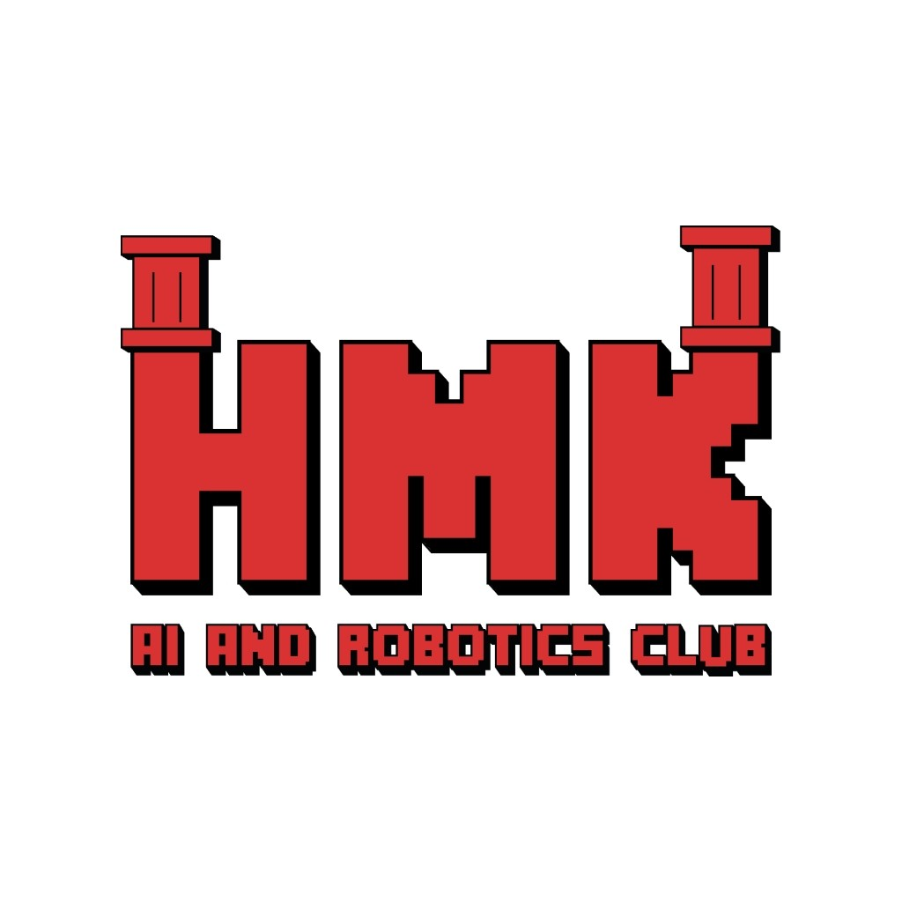
</p>

**Team The Red Castle** — HMK AI and Robotics Club.

<table>
  <tr>
    <td align="center" width="25%">
      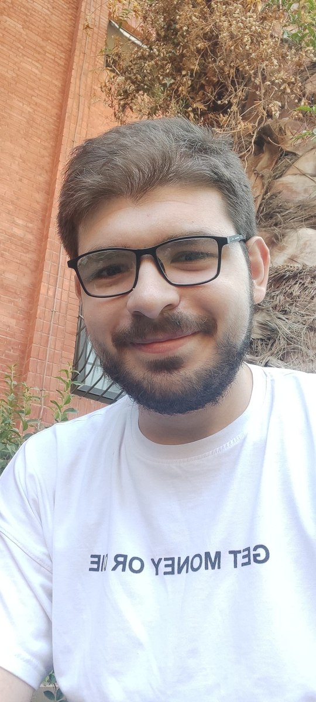<br>
      <b>Ahmad Kalthom</b><br>
      <sub>Coach</sub>
    </td>
    <td align="center" width="25%">
      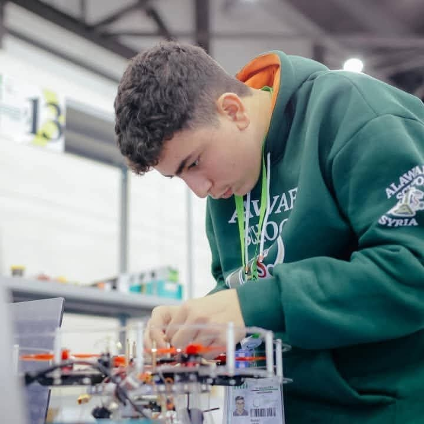<br>
      <b>Jolian Wassof</b><br>
      <sub>Team member</sub>
    </td>
    <td align="center" width="25%">
      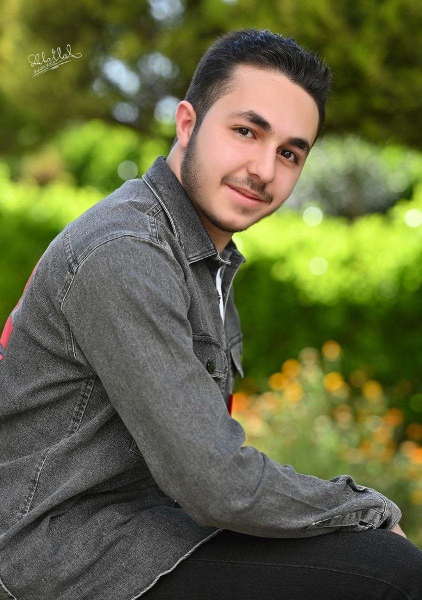<br>
      <b>Omar Shammout</b><br>
      <sub>Team member</sub>
    </td>
    <td align="center" width="25%">
      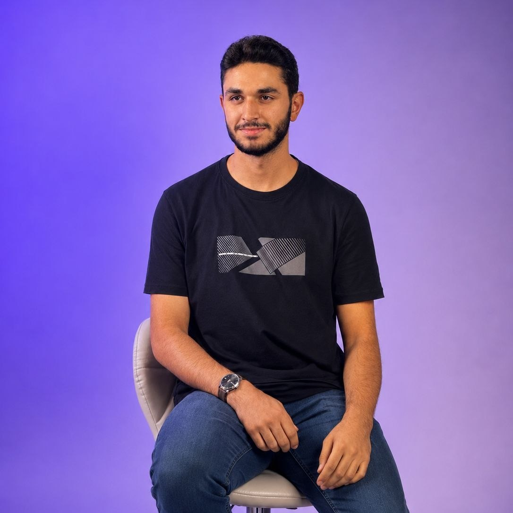<br>
      <b>Louay Rashwan</b><br>
      <sub>Team member</sub>
    </td>
  </tr>
</table>

### Ahmad Kalthom — Coach
> Computer and Automation Engineering student at Damascus University, interested
> in embedded systems and automatic control. Works on applied projects to design
> effective automation solutions within a competitive environment.

**Education:** Computer and Automation Engineering, Damascus University
**Focus areas:** Embedded Systems, Automatic Control
📧 ahmedkalthom977@gmail.com

### Jolian Wassof — Team member
> Student at Al-Awael School, interested in artificial intelligence, robotics,
> drones, and engineering. Has competed in the Pacific Olympiad in AI, the Syrian
> Olympiad in AI, and the World Robot Olympiad, as well as mobile robotics and
> unmanned aerial systems competitions. Has built several AI-based robots and
> drones, and conducts research in AI.

**Education:** Al-Awael School
**Focus areas:** Artificial Intelligence, Robotics, Drones
📧 joleanwassof@gmail.com

### Omar Shammout — Team member
> IT Engineering student at Damascus University, interested in robotics,
> artificial intelligence, programming, and electronics. Participates in
> technical activities and projects to develop skills in designing and building
> innovative solutions within a competitive environment.

**Education:** IT Engineering, Damascus University
**Focus areas:** Robotics, Artificial Intelligence, Programming, Electronics
📧 omarhamze.shammout@gmail.com

### Louay Rashwan — Team member
> Computer and Automation Engineering student at Damascus University, interested
> in robotics, artificial intelligence, and electronics. Participates in
> technical activities and projects to develop skills in designing and building
> innovative solutions within a competitive environment.

**Education:** Computer and Automation Engineering, Damascus University
**Focus areas:** Robotics, Artificial Intelligence, Electronics
📧 rashwanlouay@gmail.com

Built on a Raspberry Pi 4 with an OV5647 wide-angle camera.
