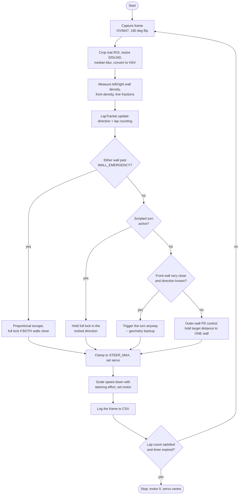
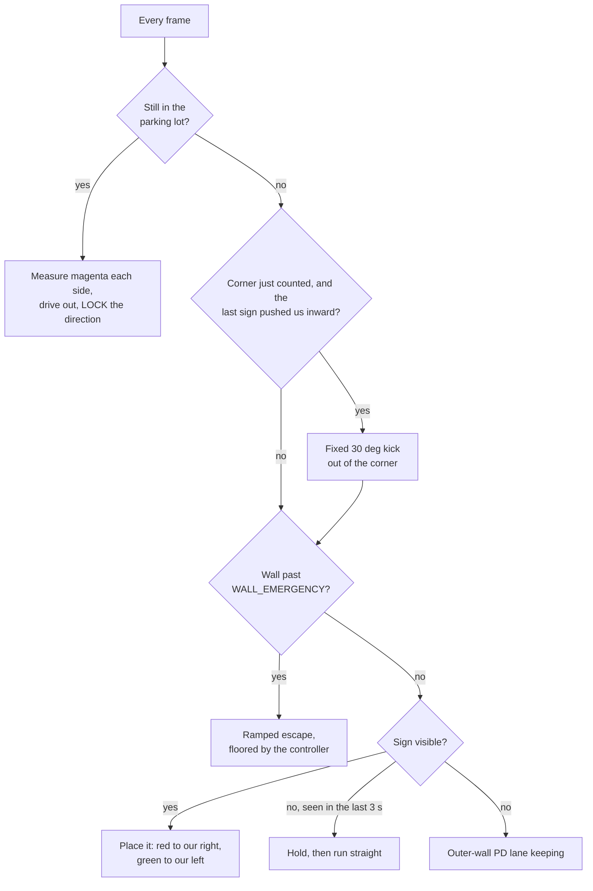
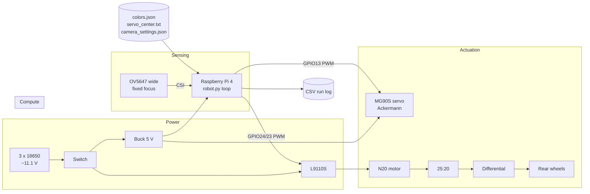

<p align="center">
  
</p>

<h1 align="center">Team The Red Castle — WRO 2026 Future Engineers</h1>

An autonomous, self-driving model car for the **World Robot Olympiad 2026,
Future Engineers** category. The mission is the **Open Challenge** (three laps of
a track with a randomised wall layout) and the **Obstacle Challenge** (three laps
avoiding red and green traffic signs, then parking in a marked bay), driven by a
**single camera as its only sensor** — no LiDAR, no ultrasonic rangefinders, no
wheel encoders, no IMU. The Open Challenge runs the full mission; the Obstacle
Challenge currently completes the driving and sign-passing portion, with the
parking manoeuvre still being wired in — see [§10](#10-results--future-work).

> **Design thesis:** everything the car needs to know — where the walls are, which
> way to lap, where the traffic signs are, and where the parking lot is — is
> visible. A well-tuned camera plus disciplined image processing can do the whole
> job, so we spent our engineering effort on making that one sensor reliable
> rather than fusing many.

---

## Table of contents
1. [The challenge](#1-the-challenge)
2. [Vehicle at a glance](#2-vehicle-at-a-glance)
3. [Mobility management](#3-mobility-management)
4. [Power & sense management](#4-power--sense-management)
5. [Software & obstacle management](#5-software--obstacle-management)
   · [flowchart](#51b-control-loop-flowchart) · [direction & laps](#51b-2-direction-and-lap-counting)
   · [obstacle priority](#51c-obstacle-challenge-priority)
   · [subsystem map](#56-how-the-subsystems-fit-together)
   · [testing & metrics](#57-testing-tuning-and-validation)
   · [risks](#58-risks-and-mitigations)
6. [Calibration workflow](#6-calibration-workflow)
7. [Build & run](#7-build--run)
8. [Bill of materials & cost](#8-bill-of-materials--cost)
9. [Engineering process](#9-engineering-process)
10. [Results & future work](#10-results--future-work)
11. [Repository map](#11-repository-map)
12. [Team](#12-team)

---

## 1. The challenge

WRO Future Engineers asks for a fully autonomous vehicle that drives a track
bounded by walls:

- **Open Challenge** — 3 laps; the inner walls are placed at random distances each
  round, so the path width changes and cannot be hard-coded.
- **Obstacle Challenge** — 3 laps with red/green **traffic signs** on the track:
  the car must pass **red signs on their right** and **green signs on their left**,
  then finish by **parking** in the magenta parking lot.

Scoring rewards completing laps without touching walls or signs, correct sign
handling, a clean park, and — importantly — **thorough engineering documentation**
(this repository).

## 2. Vehicle at a glance

| Subsystem | Choice |
|---|---|
| **Compute** | Raspberry Pi 4 Model B, **2 GB RAM** (Raspberry Pi OS *Bookworm*, 64-bit) |
| **Sensor** | **OV5647 Wide-angle** camera (5 MP, ~120° FOV, **fixed focus**) — sole sensor |
| **Steering** | **Ackermann** front steering, MG90S servo on **GPIO13**, **±35° max** |
| **Drive** | **N20 gear motor** (12 V, 200 rpm) → **25:20 gear pair** → **differential** on the rear axle |
| **Driver** | **L9110S** H-bridge on **GPIO24 / GPIO23** |
| **Control** | One push button on **GPIO19** — press to start, press again to stop |
| **Power** | 3 × 18650 (series) → motor driver directly; separate buck converter → Pi; common ground |
| **Chassis** | 3D printed in **PLA+ Silk Silver** on a **Bambu Lab A1**, designed in **Fusion 360** |
| **Software** | Python 3, OpenCV, Picamera2 |

_Vehicle photos: [`v-photos/`](v-photos) · driving video: [`video/video.md`](video/video.md)_

### Specifications

| Property | Value |
|---|---|
| Drive motor | N20 gear motor, 12 V, 200 rpm |
| Transmission | 25:20 spur pair (1.25:1) → differential, rear axle |
| Steering | Ackermann, ±35° max |
| Camera height / tilt | 12.5 cm above the mat / ~15° down |
| Mass | **407 g** |
| Theoretical top speed | **≈ 0.39 m/s** (39 cm/s), no-load — see §3.4 |
| Wheel diameter | **4.7 cm** |
| Wheelbase (front axle ↔ rear axle) | **9.4 cm** |
| Track (rear wheel centre ↔ centre) | **8.5 cm** |
| Overall dimensions (L × W × H) | **14.2 × 9.3 × 15 cm** |
| Print material | PLA+ Silk Silver |
| Printer / CAD | Bambu Lab A1 / Fusion 360 |

## 3. Mobility management

### 3.1 Chassis
A custom chassis designed in **Fusion 360** and 3D printed in **PLA+ Silk Silver**
on a **Bambu Lab A1** (source CAD, STLs and sliced plates in [`models/`](models)).
It carries the Pi, battery, motor driver, drive motor, steering servo and the
camera mast. Design priorities: low and central mass, a rigid camera mast, and
easy access to the wiring.

<p align="center">
  
  
</p>

### 3.2 Steering — Ackermann
Front-wheel **Ackermann steering** driven by a single MG90S servo (GPIO13, a
hardware-PWM pin for a smooth, low-jitter signal). Metal gears over the plain
SG90 hold up better to the full-lock steering the scripted turns and wall-
emergency escapes both drive it to repeatedly. The servo drives a central
bell-crank and tie-rod to both steering knuckles, so the **inner wheel turns more
sharply than the outer one** through a corner — each wheel follows its own turning
radius instead of fighting the other.

**Maximum steering angle: ±35°**, the mechanical limit of the linkage. `STEER_MAX`
in [`src/config.py`](src/config.py) caps *every* steering command — wall-following,
obstacle-passing and emergency turns — from one constant.

### 3.3 Drivetrain — differential
An **N20 gear motor (12 V, 200 rpm)** drives the rear axle through a **25:20 gear
pair (1.25:1 reduction)** into a **differential**.

> **Engineering decision — why a differential mattered.** Our first drivetrain
> used a *solid* rear axle, forcing both driven wheels to the same speed. In a
> corner the outer wheel must travel further than the inner one, so with a solid
> axle they *scrub* — losing traction, pushing the car wide, and sometimes
> stalling it mid-turn. We worked around it by cutting the steering limit down to
> roughly **8°**, which kept traction but left the car unable to corner properly.
> Fitting a **differential** removed the constraint at its source: the wheels can
> now rotate at different speeds, so we run the **full ±35°** of the linkage and
> corner tightly without scrub. See [`Documentation.pdf`](Documentation.pdf) §5.

The motor is driven by an **L9110S** dual H-bridge:

| L9110S | Connection |
|---|---|
| `A-IA` | GPIO24 — PWM here = **forward** |
| `A-IB` | GPIO23 — PWM here = **reverse** |
| `VCC` | Battery + (motor supply) |
| `GND` | Common ground |
| MOTOR-A | Drive motor |

Speed = PWM duty on one input, the other held LOW. The L9110S was chosen for its
tiny size and simple two-pin-per-motor interface.

> **Safety rule in software.** `motor()` **never switches forward↔reverse
> directly**: it first coasts to a stop and waits (`STOP_FLIP_DELAY`) before
> driving the other way. A hard reversal while the motor is still spinning dumps
> the motor's back-EMF onto the supply and can destroy the Pi's regulator — we
> learned this the hard way (see the journal).

### 3.4 Torque and speed reasoning

The drivetrain was sized around one question: **how fast can the car go while the
vision loop still has time to react?**

**Speed chain**

```
N20 motor          200 rpm  @ 12 V (no load)
  ↓ 25:20 spur pair (1.25:1 reduction)
Differential axle  200 / 1.25 = 160 rpm
  ↓ wheel circumference
Ground speed       v = π · D · 160 / 60   (D = wheel diameter in m)
```

With our **measured wheel diameter (4.7 cm)**:

```
v = π × 0.047 m × 160 rpm / 60 = 0.394 m/s  ≈ 39 cm/s  (no-load ceiling)
```

That is the motor's theoretical maximum with nothing slowing it down. The real
running speed is lower once tyre friction, the differential, and the car's 407 g
mass are accounted for — the 100% cruise setting in software is what actually
runs during a lap, with `cruise_speed()` easing it back further under steering.

**Why gear down at all?** The 1.25:1 reduction trades ~20 % of top speed for
~25 % more torque at the axle (torque scales with the reduction, speed inversely).
That matters because:

- The car must **pull away from rest** repeatedly and climb over the mat seam
  without stalling. Our earlier drivetrain *did* stall — see the journal.
- The L9110S wastes ~1.5–1.8 V, so the motor never sees the full pack voltage;
  extra mechanical advantage compensates for the lost electrical headroom.
- More torque means the controller can use **lower duty cycles** for the same
  motion, which keeps current (and driver heating) down.

**Why not faster?** The vision loop runs at a finite frame rate. At ~0.5 m/s the
car covers ~2–3 cm per frame, so a wall or sign is seen many frames before it
matters. Doubling the speed would halve that reaction margin without improving the
score — the challenge rewards *completing* laps cleanly, not raw speed. The
software also **reduces speed in proportion to steering effort**
(`cruise_speed()`), so the car is fastest exactly where it is safest: on straights.

**Mechanical stability.** At **407 g** total mass on a **14.2 × 9.3 × 15 cm**
footprint, the car is light and compact enough that keeping mass low and central
matters for cornering grip — the battery and Pi sit over the **9.4 cm wheelbase**,
between the front and rear axles, rather than overhanging either end. The **8.5 cm**
rear track keeps the wheelbase-to-track ratio close to 1:1, which is a stable
proportion for cornering without tipping risk. The camera sits on a rigid mast
rather than a flexible arm, and the Ackermann geometry means the wheels roll
rather than scrub through a corner. A vibrating camera would corrupt the wall
measurements, so mast rigidity is a control requirement, not a cosmetic one.

## 4. Power & sense management

### 4.1 Power topology
Early on, the Pi rebooted every time the motor drew current. The fix defines our
power design and is now standard on the car:

```
3 x 18650 (series) ─┬──────────────────────► L9110S VCC   (motor power, direct)
   via rocker switch└─► DC-DC buck (5 V) ───► Raspberry Pi 5V
Battery − ──── common ground ── L9110S GND ── Pi GND
```


_Full wiring notes: [`schemes/`](schemes)._

1. **Separate rails** — the motor draws straight from the battery; the Pi has its
   **own regulator**. Motor current spikes never pass through the Pi's supply.
2. **Common ground** — Pi, driver and battery negatives are tied together so the
   GPIO control signals share a reference. (Without it, the only link between Pi
   and driver is the signal wire, and motor return current back-feeds the GPIO pin
   — which browns out or damages the Pi.)

### 4.2 Power budget

Sizing the pack: what draws current, how much, and for how long.

| Load | Rail | Typical | Peak | Notes |
|---|---|---|---|---|
| Raspberry Pi 4 (2 GB) | 5 V (buck) | ~0.6 A | ~1.2 A | rises while the vision loop runs |
| OV5647 camera | 3.3 V via CSI | ~0.25 A | ~0.25 A | powered by the Pi, no separate rail |
| MG90S steering servo | 5 V (buck) | ~0.15 A | ~0.7 A | peak only during a fast steering step |
| N20 drive motor | 12 V (battery) | ~0.15 A | ~0.8 A | limited by the L9110S's ~0.8 A ceiling |
| L9110S quiescent | 12 V | ~0.01 A | — | negligible |

**Reasoning**

- **Pi rail:** 0.6 + 0.25 + 0.15 ≈ **1.0 A typical**, ~2.1 A worst case if the Pi
  peaks while the servo slams. The buck converter is specified at **≥ 3 A**, giving
  roughly 40 % headroom over the worst case — deliberately generous, because
  under-sizing this rail is what caused our early brownouts.
- **Motor rail:** the motor is fed **straight from the pack**, so its spikes never
  touch the Pi's rail. This separation is the single most important power decision
  on the car (§4.1).
- **Runtime:** 3 × 18650 in series keeps the *capacity* of one cell (~2500–3000 mAh)
  while tripling voltage. The 12 V side draws ~0.15 A average; the 5 V side draws
  ~1.0 A but the buck converter steps *down*, so the current it pulls from the 11 V
  pack is roughly `1.0 A × 5 V / 11 V / 0.85 ≈ 0.53 A`. Total ≈ **0.7 A**, giving on
  the order of **3–4 hours** of running — far beyond the few minutes a run needs.
  Practice sessions, not runtime, drain the pack.
- **Failure points considered:** motor stall (bounded by the L9110S current limit),
  reverse back-EMF (handled in software by a forced coast before any direction
  change), pack sag under load (why the rails are separated), and the fact that a
  freshly charged 12.6 V pack sits marginally above the L9110S's 12 V rating — a
  known watch-item logged in [`schemes/`](schemes).

_These are datasheet/typical figures used for sizing; a clamp-meter measurement of
the real draw is a pending task._

### 4.3 Sensing — the camera
The camera is the entire perception system, so most of our tuning went here.

**Sensor choice.** We began with a Raspberry Pi Camera Module 3 Wide (IMX708) but
switched to an **OV5647 wide-angle module**. The Module 3's large sensor and
autofocus lens gave a *shallow depth of field*: focus it on the mat and distant
traffic signs blurred, which desaturated their colour and made them undetectable.
The OV5647 is a **small-sensor, fixed-focus** module, so its depth of field covers
the whole track — near mat and far walls are sharp simultaneously — and there is
no autofocus to hunt mid-run. Losing autofocus cost us nothing; a ground robot
never needs to refocus.

**Connection.** The camera uses the Pi's dedicated **CSI port** via a flat ribbon
cable — it takes no GPIO pin and needs no separate power, which is why it does not
appear on the wiring diagram.

**Mount — justified by field geometry.** **12.5 cm above the mat**, tilted **~15°
downward**, centred laterally and facing straight ahead on a rigid mast. It is
physically mounted **upside-down**, so frames are rotated 180° in software.

Each number follows from the field itself:

| Choice | Driven by | Reasoning |
|---|---|---|
| **Height 12.5 cm** | walls are **10 cm** tall | The lens must sit **above the wall line** so the camera looks *down onto* the mat and sees the wall **base** — the white-mat/black-wall edge, the highest-contrast feature available. Below 10 cm the walls would fill the frame as a flat black band with no distance information. |
| **Not much higher** | depth resolution vs clutter | Raising the camera improves distance precision by only ~30 % at long range while showing more of the room *over* the walls. Not worth the extra clutter and mast flex — analysed in the journal. |
| **Tilt ~15° down** | track width & look-ahead | Enough downward angle to keep the mat and both wall bases in the lower frame, while still seeing far enough ahead to detect a corner and a traffic sign before reaching them. |
| **Centred, zero yaw** | left/right symmetry | Wall following compares the **left half against the right half** of the image. Any lateral offset or twist becomes a permanent steering bias that no amount of tuning removes. |
| **120° wide lens** | corridor width | A narrow lens cannot see **both** side walls at once in the corridor; the wide lens keeps both walls and the corner lines in a single frame. |
| **Rigid mast** | measurement noise | Vibration blurs the wall edge and injects noise straight into the steering loop, so mast stiffness is a control requirement, not cosmetic. |

**Calibration method.** Colour thresholds are field-calibrated, never hard-coded:
`tools/camera_tune.py` first fixes the *image* (exposure, gain, white balance,
saturation) and writes `camera_settings.json`; `tools/color_tuner.py` then samples
each real object on the real mat and writes `colors.json`. Steering centre is
calibrated by `tools/servo_center.py` into `servo_center.txt`. The car reads all
three files at start-up, so re-calibrating never means editing code.

**Locked settings** (`src/camera.py`), chosen from on-field capture tests:

| Setting | Value | Why |
|---|---|---|
| Sensor mode | 1296×972 (full ~120° FOV) → scaled to 640×480 | keep the wide FOV; cropped modes would lose it |
| Orientation | `hflip + vflip` (180°) | camera mounted upside-down |
| Focus | **fixed** (no AF hardware) | deep depth of field — sharp from the near mat to the far wall |
| Exposure | fixed (~9–12 ms) | freeze motion — auto-exposure ran ~60 ms and smeared when moving |
| White balance | locked `ColourGains` | keep HSV thresholds stable as the car turns toward/away from lights |
| Saturation | raised (~1.4) | separates red / orange / green / magenta in HSV, free in the ISP |

> **Why camera-only?** A single well-configured camera sees walls, the orange/blue
> corner lines, the coloured signs and the parking lot — everything the rules
> reference. Removing LiDAR/ultrasonic cut cost, weight, wiring and failure modes,
> and let us focus on making the vision robust (locked exposure/AWB, fixed focus,
> field-tuned HSV).

## 5. Software & obstacle management

All control software is in [`src/`](src). Four core modules import each other and
run together; the calibration and test utilities live in [`src/tools/`](src/tools).

```
src/robot.py               shared library — pins, servo()/motor(), HSV masks, wall/line/pillar analysis
src/camera.py              locked camera setup
src/open_challenge.py      Open Challenge main
src/obstacle_challenge.py  Obstacle Challenge main
```

### 5.1 Vision pipeline
`capture → 180° flip → crop the mat ROI → resize 320×160 → median blur → HSV`.
HSV is computed with `cv2.COLOR_BGR2HSV` everywhere so thresholds transfer between
the tuner and the challenge code. Six colours are thresholded from `colors.json`
(produced by `tools/color_tuner.py`, values shown are our measured ranges):

| Colour | Used for | HSV range (H, S, V) |
|---|---|---|
| black | walls | a **two-tier** test, not a single threshold — see below |
| blue | corner line (CCW) | H 96–135, S 60–255, V 70–200 |
| orange | corner line (CW) | H 2–13, S 72–170, V 70–255 |
| green | traffic sign | H 30–95, S 140–255, V 30–170 |
| red | traffic sign | H 170–5 (wraps), S 150–255, V 60–255 |
| magenta | parking lot | H 130–145, S 177–255, V 93–255 |

**Wall detection is a two-tier test, not a brightness threshold.** A single
"value < 62" test also lit up the blue/orange lines and the mat's printed dotted
markings, because they're dark too — and unevenly between the two frame halves,
which injected a steering bias. A real wall is either **very dark** (V < 32,
regardless of saturation) **or dark and desaturated** (V < 62 **and** S < 90).
The two-case test matters because HSV saturation is numerically unstable at very
low brightness — a black wall can report S > 200 from sensor noise, so testing
saturation alone throws real walls away. The magenta parking-lot pixels are also
counted as wall until the parking phase, since we have no parking-specific
calibration yet.

**Where colours are searched matters as much as their range.** Corner lines are
painted on the mat, so they can only appear in the image's lower portion —
searching the *whole* frame let bluish wall/background pixels near the top
trigger a false blue-line reading on ~40% of frames in one test run. Line search
is now restricted to the bottom 45% of the region of interest.

### 5.1b Control-loop flowchart

Every frame runs the same **look → think → act** loop. Each challenge program
owns its own `decide()` — one pure function holding the whole priority ladder,
with no hardware or camera in it, so the entire brain can be unit-tested on a
laptop (`tools/test_logic.py`).



### 5.1b-2 Direction and lap counting

Direction is decided **once**, from the corner lines, and is never re-decided —
that is what stops the car flipping from clockwise to counter-clockwise mid-run.

- **The first time a corner line is seen**, whichever colour has the larger pixel
  count in that frame sets the direction: orange bigger → clockwise, blue bigger
  → counter-clockwise. From that point `direction` is fixed for the whole run.
- **Wall geometry is a second opinion, not a vote.** At the same moment, if the
  two frame halves differ by at least `GEOM_DIR_MIN_DIFF` (0.08), we check
  whether geometry agrees. If it does, the log records a confirmation; if not, a
  disagreement is logged but the line's decision stands. This threshold exists
  because, measured head-on to a corner, the two halves read 0.26 vs 0.22 — a
  0.04 difference that is noise, not information, and it once produced a
  confident but wrong guess against a correct line reading.
- **Lap counting only runs once direction is known**, and only from a **line
  crossing**: a colour going from present to absent (a falling edge) counts one
  *quadrant* — but only if the line lockout timer has expired. That timer
  restarts on every count, so one physical crossing is read exactly once even if
  the mask flickers.
- **What this means honestly:** if the corner lines are never detected for an
  entire run, direction never locks and laps never count — wall-following still
  works (it defaults to the clockwise convention), but the run won't finish
  itself. `FORCE_DIRECTION` in `config.py` is the manual override for this case:
  set it before a run if lighting or colour tuning is in doubt.
- **Front-wall geometry has one job at this level**: if the car is already
  driving in a known direction and a wall gets very close ahead
  (`FRONT_TURN_BACKUP`) without a scripted turn already running, it triggers the
  turn anyway so a missed line can't drive the car into the wall. This backup
  protects the car, not the lap count — it does not add a quadrant.

Every run's log ends with a summary line, e.g. `direction=CCW via bigger line
(blue 0.061) | corners=11 (geom 0, line 11) | disagreements=0`, so a run can be
read back and checked without re-watching it.

### 5.1c Obstacle Challenge priority

Steering is decided by a strict **priority ladder** in one pure function,
`decide()`. Exactly one branch answers each frame, ordered so a lower-priority
behaviour can never override a safety-critical one.



| # | Behaviour | Why it sits at this level |
|---|---|---|
| **0** | **Parking exit** | Runs once, before the car moves. Inside the lot the magenta walls are close *on purpose*, so it must outrank the wall escape or the escape would fight the way out. |
| **1** | **Corner kick** | A committed open-loop manoeuvre. It outranks the wall escape because it is *deliberately* turning toward a wall — except when a wall closes from the **opposite** side, which cancels it. |
| **2** | **Wall escape** | Touching a wall ends the run. Ramps 50 %→100 % across the danger band and is **floored by the normal controller**, because an escape weaker than the controller it replaces steers *into* the wall (measured: −0.8° produced where the follower wanted −17°). |
| **3** | **Sign steering** | Passing signs correctly scores points, so it outranks plain lane keeping. |
| **4** | **Sign hold** | Detection flickers frame to frame (measured: one sign's area went 61 → 851 → 0 → 1060 over four frames). The hold is in **seconds**, not frames, so it does not change with frame rate. |
| **5** | **Lane keeping** | The same outer-wall PD proven in the Open Challenge, used when nothing else applies. |

**Why lane keeping exists at all.** A design that steers only toward signs and
relies on the wall override firing "often enough" between them does not hold on
our optics: measured mid-corridor readings of 0.112/0.129 against a 0.213
override threshold, meaning the car would drive dead straight for 44 % of a test
run with nothing correcting it. Falling back to the proven outer-wall controller
closes that gap.

### 5.1d Leaving the parking lot — and how it fixes the direction

The car starts inside the magenta parking lot. Whichever side is more blocked is
the side it *cannot* leave by, so the free side is both the way out **and** the
direction the lap will run. One measurement, taken before the car has moved,
answers both questions:

| what the camera sees | way out | lap direction |
|---|---|---|
| more magenta on the **left** | leave **right** | **CW** (+1) |
| more magenta on the **right** | leave **left** | **CCW** (−1) |

Because `+1` already means "steer right" everywhere in the code, the exit
steering is simply `direction × angle` — one number answers both.

The measurement is averaged over 8 frames while the car is **stationary**: the
only moment in the run with no motion blur, and worth spending. If neither side
shows enough magenta the car declines to guess and leaves the direction to the
corner lines, because a wrong direction locked at frame one would ruin the whole
run.

> **We do not add the black wall to this measurement**, although it was the
> obvious thing to try. The magenta wall physically *occludes* the black wall
> behind it, so the blocked side shows **less** black, while the open side looks
> across the track at the far outer wall and shows **more**. The two signals are
> anti-correlated: in testing, magenta read L=0.60/R=0.05 while the wall read
> L=0.40/R=0.95 — and the sum was an exact tie, the measurement cancelling
> itself. Magenta alone is the honest signal. (`PARK_USE_WALL` re-enables it.)

### 5.2 Open Challenge algorithm

1. **Direction** is set once, from the first corner line seen (§5.1b-2), and
   never changes for the rest of the run.
2. **Between corners**, a PD controller holds a fixed distance to the **outer**
   wall only — the left wall clockwise, the right wall counter-clockwise. The
   *inner* wall is never referenced, because its distance from the track centre
   is randomised each round; the outer wall is the one constant.
3. **At a corner**, crossing the driving-direction's line fires a **scripted
   turn**: full steering lock in the known direction, held for at least 0.35 s
   and at most 1.1 s, ending as soon as the way ahead reads clear rather than on
   a fixed clock. A fixed-duration turn was tried first and over-rotated into the
   inner wall in both directions (measured: inner-wall density climbed
   0.126 → 0.195 → 0.278 during one such turn) — ending on "the corner is
   clear" instead of "a timer expired" fixed that.
4. **A wall emergency always wins**, in any state: if either wall crosses
   `WALL_EMERGENCY`, the controller escapes proportionally to how close it is,
   and if *both* walls are close at once (jammed facing a corner) it latches a
   single escape direction instead of alternating between the two — an earlier
   version let left and right readings cross each other frame to frame, which
   flipped the command between +20° and −20° and made the car directionless
   exactly when it needed decisive action.
5. **Stop** once 11 quadrants are counted *and* the lap timer has expired, so the
   car finishes driving through the last straight instead of halting on the line.

### 5.3 Obstacle Challenge algorithm

1. **If a sign is visible**, steer to place it on the correct side: the target
   column is computed from the sign's position and how close it is, sliding
   further toward the frame edge as the sign nears, so the car curves around it
   rather than swerving late.
2. **If a sign was visible recently but isn't this frame**, hold the last
   command for a few frames instead of reacting to the drop-out — this is what
   keeps a single flickered detection from aborting a pass halfway through.
3. **If no sign is in view or remembered**, fall back to the same outer-wall
   lane-keeping law as the Open Challenge, so the car doesn't simply coast
   straight between signs.
4. **A wall override sits above all three** — the same emergency threshold as
   the Open Challenge, and it also does the job of turning the car through each
   corner, since the Obstacle Challenge has no separate scripted-turn sequencer.

### 5.4 Speed
Base speed is `CRUISE`; `cruise_speed()` **eases off in proportion to steering
effort**, so the car runs fast on straights and slows automatically for corners.

## 5.6 How the subsystems fit together



**Interactions that actually constrained the design**

| Interaction | Constraint it created |
|---|---|
| Motor ↔ Pi share one battery | Rails **must** be separated and grounds tied, or the Pi browns out (§4.1). |
| Drivetrain ↔ steering software | A solid axle forced the steering limit down to ~8°; the differential raised the mechanical limit to 35°. We run the software limit at **20°** for stability at full speed — mechanics set the ceiling, tuning sets where under it we actually drive. |
| Camera mount ↔ control loop | Mount height/tilt/rigidity determine what the controller can even measure; a loose mast is a control failure. |
| Lighting ↔ colour thresholds | Auto-exposure made HSV drift, so exposure and white balance are **locked** and colours re-tuned on the real mat. |
| Camera choice ↔ obstacle detection | Shallow depth of field blurred distant signs, so the sensor was swapped for a fixed-focus module. |
| Frame rate ↔ top speed | Speed is capped so the car moves only a few cm per frame, preserving reaction margin. |

## 5.7 Testing, tuning and validation

**How we test.** Each subsystem has a dedicated tool so faults are isolated rather
than guessed at (all in [`src/tools/`](src/tools)):

| Stage | Tool | What it proves |
|---|---|---|
| Wiring | `driver_on.py`, `test.py` | servo sweeps, motor turns both ways, camera captures |
| Motor limits | `motor_speed_steps.py` | steps 100 → 50 % to find the stall point |
| Motor path | `motor_debug.py` | separates a PWM fault from a power fault |
| Camera image | `camera_tune.py` | exposure/gain/saturation, with a live `mean_sat / blown% / dark%` read-out |
| Colour | `color_tuner.py` | each colour verified against its real object, mask checked for speckle |
| Wall vs shadow | `shadow_check.py` | splits dark pixels into a "tall solid run" (a real wall) vs a shallow spread (likely shadow), so a misreading can be diagnosed on the spot |
| Outer-wall control | `outer_test.py` | moves the car by hand and prints what the controller *would* steer, before it is ever trusted at speed |
| Decision logic | `test_logic.py` | the whole brain on a laptop, no Pi — 50+ assertions over `decide()`, the lap tracker and the corner kick |
| Full decision chain | `dryrun.py` | runs both challenges' `decide()` against the live camera, **motor never touched** |
| Start/stop button | `button_test.py` | confirms the button's wiring and that one press produces exactly one event |
| Full run | `open_challenge.py` / `obstacle_challenge.py` | logs every frame to `logs/*.csv` |

**Metrics we record.** Every run writes a CSV row per frame — timestamp, cycle,
direction, quadrant, in-corner flag, left/right wall, blue/orange line fractions,
steering and speed — plus a summary line (quadrants, cycles, elapsed time,
ms/cycle). That log is how we tune: after a bad run we read *why* the car did what
it did instead of guessing.

| Metric | Why it matters |
|---|---|
| ms per cycle | loop rate — sets how far the car travels blind between frames |
| quadrants counted vs. real corners | validates lap counting |
| seconds between corners | catches a corner counted twice or missed |
| left/right wall balance on a straight | proves the camera is centred and the controller is not biased |
| steering saturation (% of frames at `STEER_MAX`) | shows whether gains are too high |

**Tuning process.** Change one constant in [`src/config.py`](src/config.py) → run →
read the log → keep or revert. Because every threshold lives in one file and all
calibration lives in JSON/text files, a tuning change never risks breaking code.

## 5.8 Risks and mitigations

| Risk | Impact | Mitigation |
|---|---|---|
| Motor current spike browns out the Pi | run ends, SD card can corrupt | separate rails, own buck converter, common ground (§4.1) |
| Forward↔reverse slam destroys the regulator | hardware loss | `motor()` forces a coast + settle before any direction change |
| Lighting changes at the venue | colour masks fail | exposure/AWB locked; colours re-tuned on site in minutes via `color_tuner.py` |
| Corner line never detected all run | direction never locks, laps never count | **known limitation** — wall-following still runs (default clockwise), but the run won't self-finish; `FORCE_DIRECTION` in config is the manual override if colour is in doubt at the venue |
| One corner line missed mid-run | that quadrant undercounts | the front-wall geometry backup still forces the physical turn, so the car doesn't crash — only the count is affected, not the turn |
| Direction mis-detected | car laps the wrong way | decided once from the larger of the two line readings, cross-checked against wall geometry, then locked for the whole run |
| Camera knocked out of alignment | permanent steering bias | rigid mast; left/right balance check before every run |
| Mat markings or shadows read as a wall | false obstacle / steering bias | two-tier wall test (very dark, or dark **and** desaturated) rejects coloured lines and most shadow; `shadow_check.py` diagnoses any that still gets through — this was a live issue at two corners in field testing and is still being tightened |
| Car stuck against a wall | run wasted | `MAX_CORNER_CYCLES` and `MAX_RUNTIME_S` force an exit/stop |
| Fresh pack exceeds L9110S 12 V rating | driver overheats | monitored; noted in [`schemes/`](schemes) |
| Algorithm underperforms on the day | lost points | every tunable sits in one block at the top of the challenge file — speed, lane distance in cm, sign gains — so behaviour is retuned at the venue without touching logic |
| Car must be stopped mid-run | damage, or a wasted attempt | one button on GPIO19 starts the run and stops it at any moment; the loop polls it every frame |

## 6. Calibration workflow

Every calibration writes a file that `robot.py` loads at start-up, so the
competition code itself never has to be edited to retune the car.

| Tool | Produces | Purpose |
|---|---|---|
| `tools/tune_colors.py` | `camera_settings.json`, `colors.json` | **the venue tool.** Re-locks exposure/white balance, then every colour, then checks all pairs for overlap. Headless — runs over plain SSH. |
| `tools/tune_walls.py --detector` | `wall_settings.json` | what counts as a **wall** in this light |
| `tools/tune_walls.py` | printed constants | density ↔ centimetres, fitted through parked measurements |
| `tools/servo_center.py` | `servo_center.txt` | trim so 0° = straight (current value **−9°**) |
| `tools/button_test.py` | — | confirm the start/stop button's wiring |
| `tools/color_tuner.py` | `colors.json` | the older interactive GUI tuner (needs a screen) |

**The order matters and cannot be swapped**, because each step is measured
through the previous one: **colours → wall detector → distances**. Re-locking
the white balance after tuning colours silently invalidates them; changing the
wall detector changes every density measured against it.

**The wall detector does not use a colour range.** It uses `WALL_V_HARD`,
`WALL_V_SOFT` and `WALL_S_MAX` — three brightness/saturation cuts. Tuning the
`black` colour therefore does *not* retune the walls, which is exactly the sort
of thing that looks like it worked and has not. `tune_walls.py --detector`
samples the wall, the mat and a line and places the thresholds in the gap
between them; if wall and mat overlap in brightness it refuses to write
anything, because no threshold can separate them in that light.

Full competition-day procedure: [`other/venue-setup.md`](other/venue-setup.md).

## 7. Build & run

**Raspberry Pi OS Bookworm** — Picamera2/OpenCV come from `apt`, **not** pip
(a pip numpy shadows the apt one and breaks Picamera2):

```bash
sudo apt install -y python3-picamera2 python3-libcamera python3-opencv python3-rpi-lgpio python3-venv
```

### Running a challenge

```bash
cd ~/wro2026 && source .venv/bin/activate && python open_challenge.py
```

Then **press the button**. Nothing moves before that — the program arms and
waits. Pressing it again stops the run at any moment; it is also the emergency
stop, and the loop polls it every frame.

### At the start line, with no laptop

```bash
./autostart.sh on
```

The program then launches at every power-on, so the start-line procedure becomes
**power the car, press the button**. This is safe precisely *because* the
program waits for the button: booting into it only arms the car. When a run
finishes the service restarts it, re-arming it for the next press. Which program
runs is one line at the top of `run.sh`.

### Before every deploy

```bash
python tools/test_logic.py    # the whole brain, on a laptop, no Pi needed
python tools/dryrun.py        # both challenges, live camera, motor untouched
```

## 8. Bill of materials & cost

Full component list: [`other/bill-of-materials.md`](other/bill-of-materials.md).
Wiring: [`schemes/`](schemes). **Total build cost: ≈ $120** (electronics, printed
parts, fasteners and battery combined).

## 9. Engineering process

The interesting part of this project was making one camera and a cheap drivetrain
reliable. The full design log — sensor choice, the power-brownout debugging, the
motor stall, the no-differential steering decision, and the camera focus/exposure
tuning — is in the Evolution section of **[`Documentation.pdf`](Documentation.pdf)**.

## 10. Results & future work

**Open Challenge — complete.** The vehicle drives the full three laps and stops
correctly **in both directions (clockwise and counter-clockwise)** with stable
control, holding its line along the straights and taking the corners without
contact. Both driving directions are demonstrated in the submitted video.

The decisive fix was not in the controller but in the perception: the wall
detector had been counting the blue and orange corner lines, and the mat's printed
markings, as walls — see [`Documentation.pdf`](Documentation.pdf) §5. Once
corrected, every distance constant was re-measured, so the control setpoints are
now real distances (driving line 40 cm from the outer wall, emergency at 18 cm,
full steering lock at 20 cm of error) rather than tuned pixel fractions.

**Obstacle Challenge — driving and sign-passing complete, parking not yet wired
in.** Sign passing (red on the right, green on the left) and lane keeping between
signs both run, with a short memory that holds a manoeuvre through a flickered
detection instead of aborting it. The magenta parking lot is currently treated
purely as a wall to avoid; detecting the gate and executing the approach is
built into `config.py` as reserved constants but not yet connected into the main
loop. The other known open issue is **shadow at two of the four corners**
occasionally being read as part of the wall, which biases the density measurement
there; `tools/shadow_check.py` was built specifically to separate a genuine wall
(a tall, solid dark run) from a shadow (broad and shallow) and diagnose it in the
field, and the wall test is being tightened against it.

**Future work.**
- Wire the parking manoeuvre into the Obstacle Challenge's main loop.
- Close out the corner-shadow misreading identified above.
- Upgrade wall-following from a pure PD law to a heading + offset controller, so
  the car holds a straighter line rather than correcting after it has already
  drifted.
- Track a sign's position across frames rather than per-frame, to smooth the
  approach further than the current short-memory hold already does.

## 11. Repository map

```
README.md                 # this engineering document
Documentation.pdf          # printable engineering journal (hard-copy submission)
CHECKLIST.md               # submission checklist
src/                       # control software (core + tools/)
models/                    # 3D-printable parts + source CAD
schemes/                   # wiring / electromechanical diagrams
t-photos/                  # team photos
v-photos/                  # vehicle photos (6 angles)
video/                     # link to the driving demonstration
other/                     # BOM, rulebook, misc
```

## 12. Team

<p align="center">
  
  &nbsp;&nbsp;&nbsp;
  
</p>

**Team The Red Castle** — HMK AI and Robotics Club.

<table>
  <tr>
    <td align="center" width="25%">
      <br>
      <b>Ahmad Kalthom</b><br>
      <sub>Coach</sub>
    </td>
    <td align="center" width="25%">
      <br>
      <b>Jolian Wassof</b><br>
      <sub>Team member</sub>
    </td>
    <td align="center" width="25%">
      <br>
      <b>Omar Shammout</b><br>
      <sub>Team member</sub>
    </td>
    <td align="center" width="25%">
      <br>
      <b>Louay Rashwan</b><br>
      <sub>Team member</sub>
    </td>
  </tr>
</table>

### Ahmad Kalthom — Coach
> Computer and Automation Engineering student at Damascus University, interested
> in embedded systems and automatic control. Works on applied projects to design
> effective automation solutions within a competitive environment.

**Education:** Computer and Automation Engineering, Damascus University
**Focus areas:** Embedded Systems, Automatic Control
📧 ahmedkalthom977@gmail.com

### Jolian Wassof — Team member
> Student at Al-Awael School, interested in artificial intelligence, robotics,
> drones, and engineering. Has competed in the Pacific Olympiad in AI, the Syrian
> Olympiad in AI, and the World Robot Olympiad, as well as mobile robotics and
> unmanned aerial systems competitions. Has built several AI-based robots and
> drones, and conducts research in AI.

**Education:** Al-Awael School
**Focus areas:** Artificial Intelligence, Robotics, Drones
📧 joleanwassof@gmail.com

### Omar Shammout — Team member
> IT Engineering student at Damascus University, interested in robotics,
> artificial intelligence, programming, and electronics. Participates in
> technical activities and projects to develop skills in designing and building
> innovative solutions within a competitive environment.

**Education:** IT Engineering, Damascus University
**Focus areas:** Robotics, Artificial Intelligence, Programming, Electronics
📧 omarhamze.shammout@gmail.com

### Louay Rashwan — Team member
> Computer and Automation Engineering student at Damascus University, interested
> in robotics, artificial intelligence, and electronics. Participates in
> technical activities and projects to develop skills in designing and building
> innovative solutions within a competitive environment.

**Education:** Computer and Automation Engineering, Damascus University
**Focus areas:** Robotics, Artificial Intelligence, Electronics
📧 rashwanlouay@gmail.com

Built on a Raspberry Pi 4 with an OV5647 wide-angle camera.
